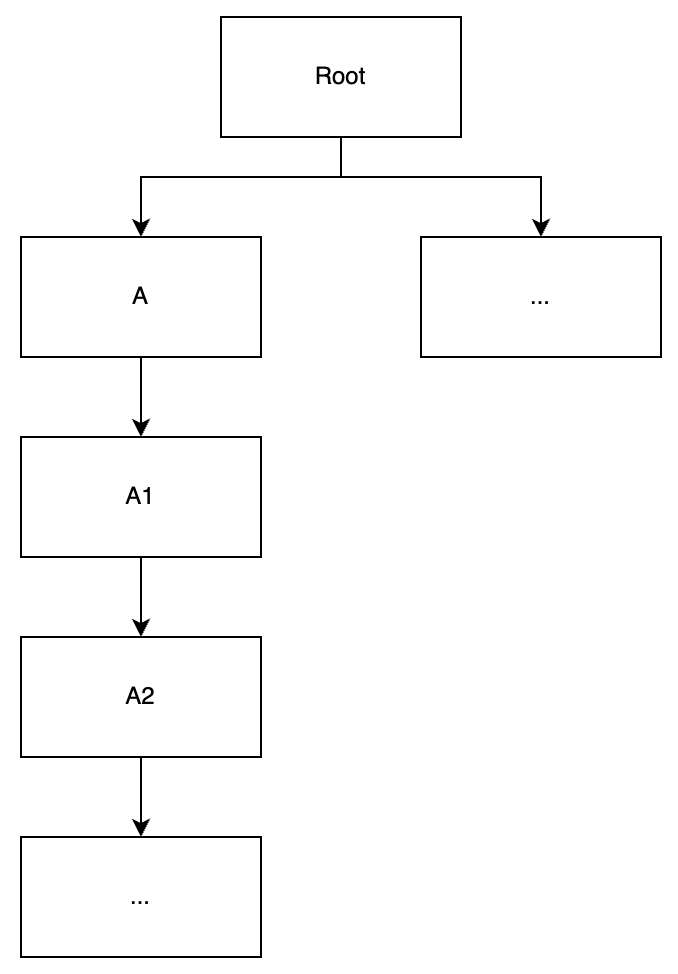
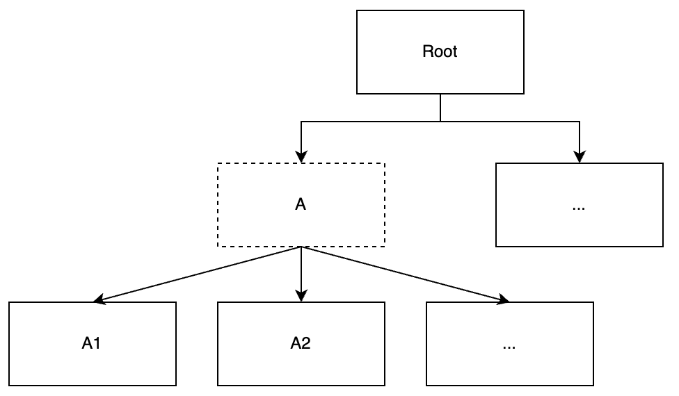
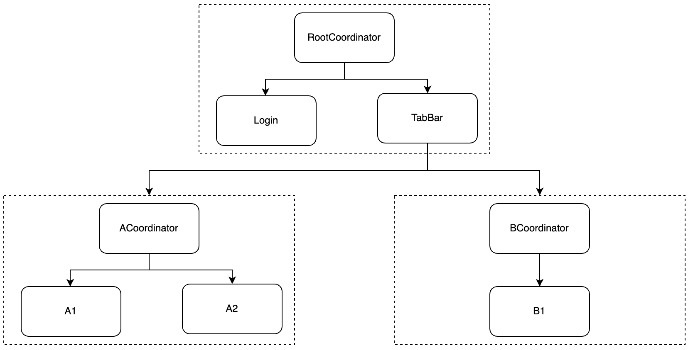
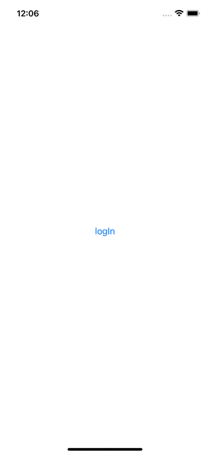

**이전글:** TCA101: https://github.com/dev-wimes/TCAExample/tree/a335cd5bb4e616dc38e5d9e33ff17c063e81213b
# TCACoordinator

## 개요

TCACoordinator를 사용해보려고 한다.
TCACoordinator를 사용하고자 하는 이유는 다음과 같은 pain point때문인데

* 화면이동 코드가 너무 지저분 하다.

  * NavigationLink를 사용하면 Declarative UI의 특성을 살릴 수 가 없다.

  * view에서 화면이동 action이 발생하면 action를 분리해서 처리해줄 수 없을까? 

  * TCA에서 현재 View에서 특정 View로 넘어갈 때 다음과 같은 코드를 작성해야 한다.

    ```swift
    NavigationView{
    	VStack{
      	Text(viewStore.resultString)
        NavigationLink {
        	A2View(store: Store(
          	initialState: A2State(resultString: ""),
            reducer: a2Reducer,
            environment: A2Environment(
            	request: {EffectsImpl().numbersApiThree()},
            	mainQueue: {.main}
            )))
    		} label: {
        	Text("open the A2 View")
        }
    	}
      .navigationTitle("A1")
    }
    ```

* Feature 또는 Package 내에서 Depth가 너무 깊어진다.

  * A에서 A1으로 이동하려면 A는 A1을 import 해줘야 한다. (A1, A2, A3, ... 도 마찬가지 import의 향연...)

    

딱 떠오르는 패턴은 Coordinator 패턴이다.

화면의 이동을 Coordinator 해준다. View간의 이동에 대한 처리를 Coordinator가 맡아서 처리하고 (아래 코드처럼 버튼에 대한 action만 발생해주면 된다. 위 코드랑 비교해보면 얼마나 깔끔한가)

```swift
VStack {
  Text(viewStore.resultString)
  Button {
  	viewStore.send(.didTapButton)
   } label: {
   	Text("open the A2 View")
   }
}
.navigationBarTitle("A1", displayMode: .inline)
```

부모 피쳐에서는 자식 피쳐에 대한 정보를 알 필요가 없다. Coordinator가 알고 있으면 된다.(아까 코드를 보면 A2에 대한 정보가 필요 없다.)



## 설계 및 구현

아래와 같은 구조를 만드려고 한다.



큰 Feature를 Coordinator로 묶고 피쳐간 의존성도 Coordinator로 결속?한다.
Coordinator가 Router라고 생각하면 이해가 쉽다.

우선 https://github.com/johnpatrickmorgan/TCACoordinators 에서 TCACoordinator를 Package에 추가해준다.

**Effects/Package.swift**

```swift
let package = Package(
    name: "Effects",
    platforms: [.iOS(.v15)],
    products: [
        .library(name: "Effects", type: .dynamic, targets: ["Effects"]),
    ],
    dependencies: [
        .package(
            url: "https://github.com/pointfreeco/swift-composable-architecture",
            .upToNextMajor(from: "0.36.0")
        ),
        .package(
            url: "https://github.com/johnpatrickmorgan/TCACoordinators",
            .upToNextMajor(from: "0.2.0")
        ),
    ],
    targets: [
        .target(
            name: "Effects",
            dependencies: [
                .product(name: "ComposableArchitecture", package: "swift-composable-architecture"),
                .product(name: "TCACoordinators", package: "TCACoordinators")
            ]),
        .testTarget(
            name: "EffectsTests",
            dependencies: ["Effects"]),
    ]
)
```


TCACoordinator의 구성은 다음과 같다.

* Interactor (State, Action, Reducer, view-less)
  * 피쳐의 State, Action, Reducer를 담고 있다. TCA기본 구성요소이므로 따로 설명은 필요없을 듯 하다.
* Screen (view-less)
  * 각 모듈들을 가져와서 리듀서를 만들어주고 관리해주기 위함
* Coordinator
  * 본격적으로 화면이동, 흐름을 관리해준다.
* View
  * CoordinatorView를 생성해 노출시켜준다.

다음으로 TCACoordinator의 실제 적용 예제를 볼텐데 구조가 단순하고 케이스가 그리 많지 않으니 Root 피쳐만 설명한다.

RootCoordinator는 Login과 TabBar를 포함한다. Login에서 특정 이벤트가 발생하면 TabBar로 화면이 넘어가도록 한다.

### Login

**LoginView**
는 버튼을 누르면 event발생시키는게 전부이다.

```swift
struct LoginView: View {
    
    let store: Store<LoginState, LoginAction>
    
    var body: some View {
        WithViewStore(self.store){ viewStore in
            VStack {
                Button {
                    viewStore.send(.loggedIn(loginData: "I'm Signed In!"))
                } label: {
                    Text("logIn")
                }
            }
        }
    }
}
```


**LoginInteractor**
에서는 로컬 이벤트(Login 내에서만 발생되고 처리되는 이벤트) 처리가 필요없기 때문에 reducer는 비어있다.

```swift
struct LoginState: Equatable { }

enum LoginAction {
    case loggedIn(loginData: String)
}

struct LoginEnvironmnet { }

let loginReducer: Reducer<
    LoginState,
    LoginAction,
    LoginEnvironmnet
> = Reducer { _, _, _ in
    return .none
}
```


### TabBar

**TabBarView**
의 특징은

* navigationView의 속성값 변경
* TabView를 통해 하위 피쳐들에 대한 접근

이다.

우선 TabBarView부터는 NavigationView를 사용한다.
TCACoordinator의 경우 내장되어 있는 프로퍼티를 통해 NavigationView를 사용하게 되는데
NavigationView를 커스텀할 수 있는지 알아보기 위해 구현해봤다.

```swift
init(store: Store<TabBarState, TabBarAction>) {
  self.store = store

  let navigationAppearance = UINavigationBarAppearance()
  navigationAppearance.configureWithTransparentBackground()
  navigationAppearance.backgroundColor = .systemRed

  UINavigationBar.appearance().standardAppearance = navigationAppearance
  UINavigationBar.appearance().compactAppearance = navigationAppearance
  UINavigationBar.appearance().scrollEdgeAppearance = navigationAppearance
  UINavigationBar.appearance().tintColor = .black
}
```

우선은 navigation의 root(앱 전체의 Root를 의미하는 게 아님. NavigationStack에서 TabBar가 시작점이라 Root라 한 것.)에서는 Appearance정도 변경할 수 있는 것 같다.
위 코드를 작성하면 하위 navigation들에게 전부 영향을 받는다.

> **번외**
>
> App전체에 영향을 주고 싶다면 아래와 같은 방법을 쓰도록 하자
>
> ```swift
> import SwiftUI
> 
> extension UINavigationController {
>     open override func viewWillLayoutSubviews() {
>         super.viewWillLayoutSubviews()
>         navigationBar.topItem?.backButtonDisplayMode = .minimal
>     }
> }

body에는 TabView 내부에 A, B CoordinatorView가 호출되고 있는 것을 볼 수 있다.

```swift
WithViewStore(self.store) { viewStore in
	TabView {
  	ACoordinatorView(store: self.store.scope(
    	state: \.a,
      action: TabBarAction.a
    ))
    .tabItem {
    	Image(systemName: "list.dash")
      Text("A")
		}
                
		BCoordinatorView(store: self.store.scope(
    	state: \.b,
      action: TabBarAction.b
    ))
    .tabItem {
    	Image(systemName: "list.dash")
      Text("B")
		}
	}
  .onAppear {
  	print("loginData: ", viewStore.loginData)
	}
}
```


**TabBarInteractor**
는 A, B를 사용해야 하므로 a, b Reducer를 combine한다.

```swift
struct TabBarState: Equatable {
    var loginData: String
    
    var a = ACoordinatorState()
    var b: BCoordinatorState
    
    init(loginData: String) {
        self.loginData = loginData
      	// loginData를 B1에 넘겨주기 위함
        self.b = BCoordinatorState(routes: [.root(.b1(.init(loginData: loginData)))])
    }
}

enum TabBarAction {
    case a(ACoordinatorAction)
    case b(BCoordinatorAction)
}

struct TabBarEnvironmnet { }

let tabBarReducer: Reducer<
    TabBarState,
    TabBarAction,
    TabBarEnvironmnet
> = .combine(
    aCoordinatorReducer
        .pullback(
            state: \.a,
            action: /TabBarAction.a,
            environment: { _ in .init() }
        ),
    bCoordinatorReducer
        .pullback(
            state: \.b,
            action: /TabBarAction.b,
            environment: { _ in .init() }
        )
)
```


### RootCoordinator

TCACoordinator예제를 보면 각 Coordinator마다 Screen과 Coordinator가 있다.
Screen은 view-less이고 Coordinator는 viewable이다.

**RootScreen**
은 앞서 말했듯이 각 모듈들을 가져와서 리듀서를 만들어주고 관리만 해준다. 따라서 view가 없다.

```swift
enum RootScreenState: Equatable {
    case login(LoginState)
    case tabBar(TabBarState)
}

enum RootScreenAction {
    case login(LoginAction)
    case tabBar(TabBarAction)
}

struct RootScreenEnvironment { }

let rootScreenReducer = Reducer<
    RootScreenState,
    RootScreenAction,
    RootScreenEnvironment
>.combine([
    loginReducer.pullback(
        state: /RootScreenState.login,
        action: /RootScreenAction.login,
        environment: { _ in LoginEnvironmnet() }
    ),
    tabBarReducer.pullback(
        state: /RootScreenState.tabBar,
        action: /RootScreenAction.tabBar,
        environment: { _ in TabBarEnvironmnet() }
    )
])
```


**RootCoordinator**
은 실제 화면간의 처리를 해준다. TCACoordinators를 import해야하며, `IndexedRouterState`, `IndextedRouterAction`을 상속받아서 State, Action을 구현해야 한다.

```swift
struct RootCoordinatorState: Equatable, IndexedRouterState {
    var routes: [Route<RootScreenState>]
    
    init(routes: [Route<RootScreenState>] = [.root(.login(.init()))]) {
        self.routes = routes
    }
}

enum RootCoordinatorAction: IndexedRouterAction {
    case routeAction(Int, action: RootScreenAction)
    case updateRoutes([Route<RootScreenState>])
}

struct RootCoordinatorEnvironment { }
```

State에는 routes라는 Route 배열이 있다.
화면이동은 이 routes를 이용해 하게 되는데 배열로 선언된 이유는 화면들을 관리하기 위함이다. 
즉, 배열에 새로운 화면 State를 추가하면 push이고, 제거하면 pop이 되는 메커니즘이다.
내부 메서드들을 보면 append, remove가 있는 것으로 봐서 위의 내용이 무엇인지 대충 어떤 느낌인지 알 수 있다.

Action에는 `routeAction`, `updateRoutes`가 있다.
프로토콜을 보면 다음과 같다.

```swift
public protocol IndexedRouterAction {

  associatedtype Screen
  associatedtype ScreenAction

  /// Creates an action that allows routes to be updated whenever the user navigates back.
  /// - Returns: An `IndexedScreenCoordinatorAction`, usually a case in an enum.
  static func updateRoutes(_ screens: [Route<Screen>]) -> Self

  /// Creates an action that allows the action for a specific screen to be dispatched to that screen's reducer.
  /// - Returns: An `IndexedScreenCoordinatorAction`, usually a case in an enum.
  static func routeAction(_ index: Int, action: ScreenAction) -> Self
}

```

`routeAction`은 action이 발생했을 때 trigger된며, Int와 ScreenAction을 받게 된다.
index는 해당 케이스를 트리거 시킨 시점에서 route의 count를 리턴한다.
action은 해당 Action의 case를 받을 수 있다. 즉, 어떠한 action의 트리거를 받게 된다.

`updateRoutes`는 RootCoordinatorState의 routes가 없어질 때(pop, dismiss 등)  Route 배열을 받게 된다.
routes를 받게 되기 때문에 화면조작과 관련된 일을 할 수 있다.
예를 들면 A2에서 back했을 때 B1을 push하라는 코드를 짜고 싶다면 다음과 같이 하면 된다.

```swift
....
case .updateRoutes(let routes):
	routes.push(.b1(.init()))
	return .none
}
...
```


```swift
let rootCoordinatorReducer: Reducer<
    RootCoordinatorState,
    RootCoordinatorAction,
    RootCoordinatorEnvironment
> = rootScreenReducer
    .forEachIndexedRoute(environment: { _ in RootScreenEnvironment() })
    .withRouteReducer(
        Reducer { state, action, environment in
            switch action {
            case .routeAction(_, action: .login(.loggedIn(let loginData))):
                state.routes.presentCover(.tabBar(.init(loginData: loginData)), embedInNavigationView: true)
                return .none
            case .routeAction(_, action: .tabBar(_)):
                return .none
            case .updateRoutes(_):
                return .none
            }
        }
    )
```

reducer에서는 `forEachIndexedRoute`와 `withRouteReducer`를 이용해 각 화면들을 관리한다.
README에는 모든 `forEachIndexedRoute` route를 결합하고
 `withRouteReduer` 에서 reducer 형태로 변환해서 
모든 case에 대한 trigger를 받을 수 있도록 되어 있다.

예제에는 `loggedIn` 트리거가 발생하면 tabBar를 띄우고 login성공 증거로 loginData를 주입해주고 있다.
그리고 tabBar 부터는 navigationStack을 사용해야 하므로 embedInNavigationView을 true로 해준다.


**RootCoordinatorView**

아서 만든 Coordinator를 이용해 화면을 그릴 View를 만들어준다.

```swift
import SwiftUI
import ComposableArchitecture
import TCACoordinators


struct RootCoordinatorView: View {
    let store: Store<RootCoordinatorState, RootCoordinatorAction>
    
    var body: some View {
        TCARouter(store) { screen in
            SwitchStore(screen) {
                CaseLet(
                    state: /RootScreenState.login,
                    action: RootScreenAction.login,
                    then: LoginView.init
                )
                CaseLet(
                    state: /RootScreenState.tabBar,
                    action: RootScreenAction.tabBar,
                    then: TabBarView.init
                )
            }
        }
    }
}
```

TCARouter로 한번 감싸고 TCA예제에서 봤던 SwitchStore, CaseLet을 이용해 case별로 화면이 변경될 것을 암시 해준다.


**RootView, @main**

마지막으로 CoordinatorView를 RootView에서 생성해주고, RootView는 main에서 나오도록 한다.

```swift
struct RootView: View {
    var body: some View {
        RootCoordinatorView(store: .init(
            initialState: .init(),
            reducer: rootCoordinatorReducer,
            environment: RootCoordinatorEnvironment()
        ))
    }
}
```

```swift
@main
struct Modular_TCAApp: App {
    var body: some Scene {
        WindowGroup {
            RootView()
        }
    }
}
```




## Reference

* https://green1229.tistory.com/272?utm_source=pocket_mylist
* https://github.com/johnpatrickmorgan/TCACoordinators
* https://velog.io/@frankjinhan/RIBs-Flattening

## What is Next

피쳐를 SPM으로 나누면해당 피쳐만 독립적으로 실행시킬 수 없다. 이러면 모듈화의 의미가 없어진다.
첫번째로 의존성을 끊어내는 작업을 진행할 것이다. State, Action, Environment, reducer를 추상화 시켜서 모듈별로 약한 의존성을 갖게 할 것이다.
각 피쳐별로 Demo.xcodeproj를 만들어서 Demo App까지 돌리는 것이 다음 목표이다.


